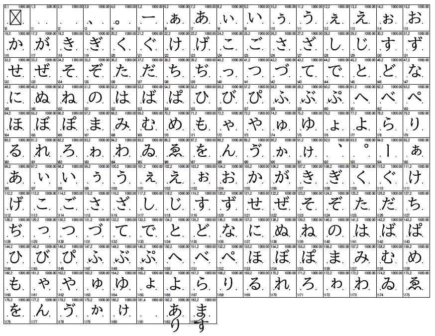

# Remmen GSUB Demo

This repository is a companion material for a series of my articles ([#1](https://zenn.dev/morisawa/articles/remmentai-font-1), [#2](https://zenn.dev/morisawa/articles/remmentai-font-2) and [#3](https://zenn.dev/morisawa/articles/remmentai-font-3)) published onto Zenn, which illustrate how to design and implement a Japanse remmen-tai (connected script) font using [contextual substitution techniques](https://github.com/morisawa-inc/RemmenGSUBDemo/blob/main/sources/ufo/RemmenGSUBDemo-Regular.ufo/features.fea).

Download the latest version of the demo font from [here](https://github.com/morisawa-inc/RemmenGSUBDemo/blob/main/fonts/otf/RemmenGSUBDemo-Regular.otf). The font is based on [BIZ UD Mincho Medium](https://github.com/googlefonts/morisawa-biz-ud-mincho) hosted on GitHub as part of the Google Fonts library.

このリポジトリは、Zenn の記事『フォントでつながった文字を表現する』（[#1](https://zenn.dev/morisawa/articles/remmentai-font-1), [#2](https://zenn.dev/morisawa/articles/remmentai-font-2), [#3](https://zenn.dev/morisawa/articles/remmentai-font-3)）の関連資料です。[GSUB](https://github.com/morisawa-inc/RemmenGSUBDemo/blob/main/sources/ufo/RemmenGSUBDemo-Regular.ufo/features.fea) を活用した連綿体フォントの設計と実装のデモです。

デモフォントの最新版は[こちら](https://github.com/morisawa-inc/RemmenGSUBDemo/blob/main/fonts/otf/RemmenGSUBDemo-Regular.otf)からダウンロードできます。このフォントは [BIZ UD Mincho Medium](https://github.com/googlefonts/morisawa-biz-ud-mincho) をベースにしており、派生元フォントは Google Fonts ライブラリの一部として GitHub から取得できます。

## Building

If you want to build fonts manually on your own computer:

* `cd sources && sh ./build.sh` will produce a font file using your local Python environment. Note that you should `pip install afdko=4.0.0` before production.
* `sh ./build_font.sh` will produce a font file using docker, which automatically set up development environment in a docker image and produce a font file.

## License

This Font Software is licensed under the SIL Open Font License, Version 1.1.
This license is available with a FAQ at
https://scripts.sil.org/OFL
